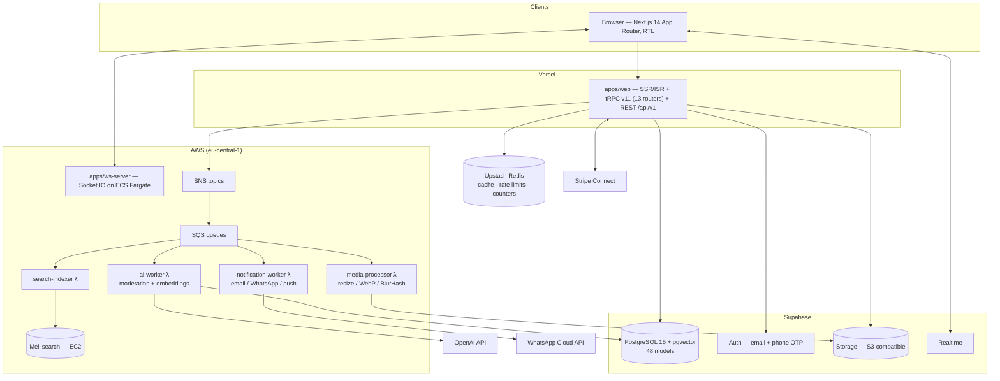

# Kehila — Community & Marketplace Platform

[](https://github.com/yossime/community-platform/actions/workflows/ci.yml)

**Kehila** is an RTL-first, Hebrew-language professional community and marketplace platform: discussion forums, a freelance marketplace with Stripe Connect escrow, classifieds, portfolios, online courses, articles, real-time messaging, and an AI-powered moderation pipeline — built as a single Turborepo monorepo (~30K lines of TypeScript across 15 workspaces). It is designed for an audience that browses behind strict content-filtering proxies, which forces some unusual engineering: every asset self-hosted on a single origin, no third-party scripts or social SDKs, no social login, and AI modesty screening of every uploaded image before it becomes visible.

## Features

- **Forums** — categories → forums → threads → posts, reactions, polls, subscriptions, reputation/badges
- **Freelance marketplace** — projects, proposals, milestone-based **Stripe Connect escrow**, reviews, AI job matching (pgvector cosine similarity over embeddings)
- **Classifieds** — categorized listings with image galleries and contact reveal
- **Portfolios** — Behance-style grids with media processing (WebP variants, BlurHash placeholders)
- **Courses** — lessons, enrollment, progress tracking, quizzes
- **Articles** — Tiptap rich-text publishing with editor's picks
- **Messaging** — real-time conversations (Socket.IO + Supabase Realtime hybrid)
- **Search** — Meilisearch (7 indexes) + semantic search via pgvector
- **Moderation** — 3-stage pipeline: sanitize → OpenAI moderation + GPT-4o vision modesty check → human review queue
- **Memberships** — tiered subscriptions billed through Stripe

## Architecture



Content flow example — a user posts to a forum: tRPC mutation → Zod validation → auth + rate-limit middleware → Prisma insert (`moderationStatus: PENDING`) → Redis counter → SNS fan-out → three SQS queues drive AI moderation, search indexing, and subscriber notifications in parallel.

## Stack

| Layer | Technology |
|---|---|
| Frontend | Next.js 14 (App Router), React 18, Tailwind CSS + shadcn/ui, Tiptap |
| API | tRPC v11 (13 routers) internal, versioned REST `/api/v1/` public |
| Database | PostgreSQL 15 + pgvector (Supabase), Prisma 5 — 48 models, 25 enums |
| Auth | Supabase Auth — email + phone OTP (deliberately no social login) |
| Cache | Upstash Redis — write-through, sliding-window rate limiting, buffered counters |
| Search | Meilisearch (7 indexes) + pgvector semantic search |
| Real-time | Supabase Realtime + Socket.IO server (ECS Fargate) |
| Payments | Stripe Connect — subscriptions + marketplace escrow with milestones |
| AI | OpenAI — moderation, GPT-4o vision image screening, `text-embedding-3-small` matching |
| Async work | SNS → SQS → 4 Lambda workers (Docker images) |
| Messaging | WhatsApp Cloud API (OTP + notifications), Resend + React Email |
| Infra | Terraform (AWS), Vercel, Docker, GitHub Actions |
| Testing | Vitest (unit) + Playwright (E2E) |

## Monorepo Layout

```
apps/web                Next.js app          apps/ws-server        Socket.IO server
packages/api            tRPC routers         packages/db           Prisma schema + seed
packages/ui             RTL component lib    packages/ai           OpenAI wrappers
packages/payments       Stripe Connect       packages/search       Meilisearch client
packages/cache          Redis patterns       packages/email        React Email
packages/whatsapp       WhatsApp Cloud API   packages/config       shared configs
workers/*               4 SQS Lambda workers
infrastructure/         Terraform + Docker + ops scripts
docs/architecture/      15 specification documents
```

## Running Locally

Requires Node 20, pnpm, and Docker.

```bash
pnpm install

# Postgres 15 + pgvector, Redis 7, Meilisearch, MailDev
cd infrastructure/docker && cp .env.example .env && docker compose up -d && cd ../..

cp .env.example .env.local   # fill in values (local defaults in docs/DEVELOPMENT.md)

pnpm db:generate && pnpm db:push && pnpm db:seed
pnpm dev
```

Full guide: [docs/DEVELOPMENT.md](docs/DEVELOPMENT.md) · Production deployment: [DEPLOY.md](DEPLOY.md)

## Tests & CI

```bash
pnpm typecheck        # all 15 workspaces
pnpm test             # 146 unit tests (Vitest)
pnpm test:e2e         # Playwright suites (10 spec files)
```

GitHub Actions CI runs lint, typecheck, unit tests (against pgvector + Redis service containers), and a full build on every push and pull request. Production deployment is a separate manually-triggered workflow (requires cloud credentials as repo secrets).

## Documentation

The platform is specified in 15 architecture documents under [`docs/architecture/`](docs/architecture/) — system overview, database schema, API layer, auth/RBAC, realtime, search, AI services, storage/CDN, deployment, caching, security, and the RTL/cultural engineering constraints that shaped the design.

## How It Was Built

This platform was built AI-assisted: the architecture was specified up front in the 15 documents above, and the implementation was generated with Claude Code working against those specs — directed, reviewed, integrated, and deployed by me (Yossi Mendelovitz). The design decisions, the cultural/technical constraints (single-origin assets, RTL-first logical CSS, the moderation pipeline), the spec documents, and the debugging of everything from Prisma engine bundling on Vercel to Redis edge cases are human work; a large share of the line-by-line code is machine-generated to those specifications. I think this is an honest picture of how modern software gets built, and this repo is meant to show I can direct that process end to end.

## License

[MIT](LICENSE)
